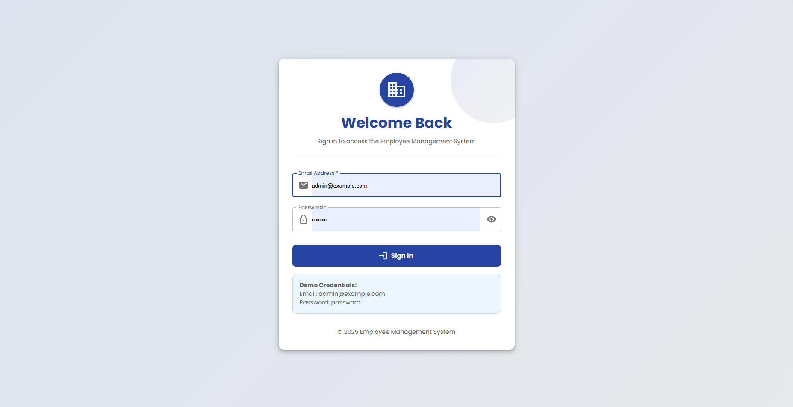
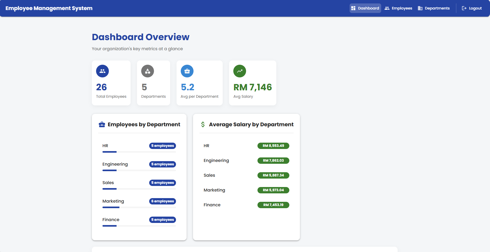
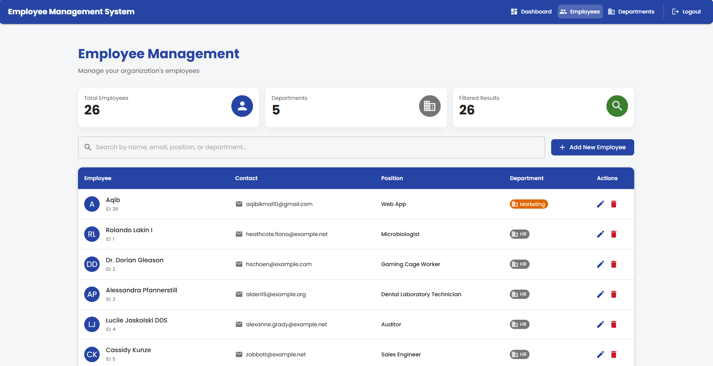
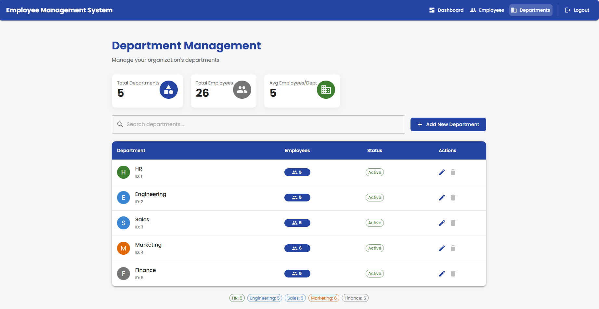
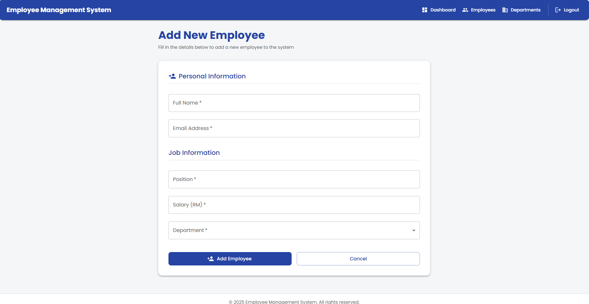
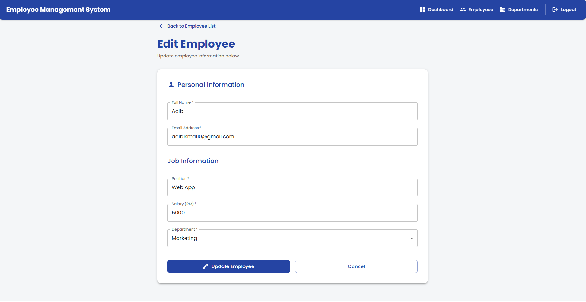
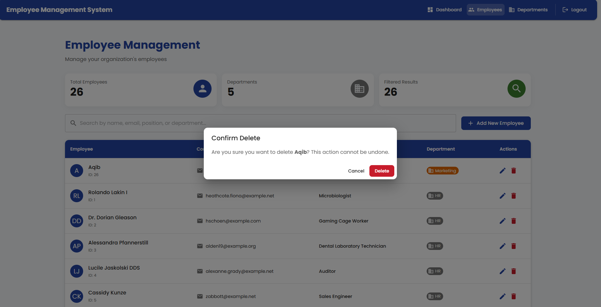
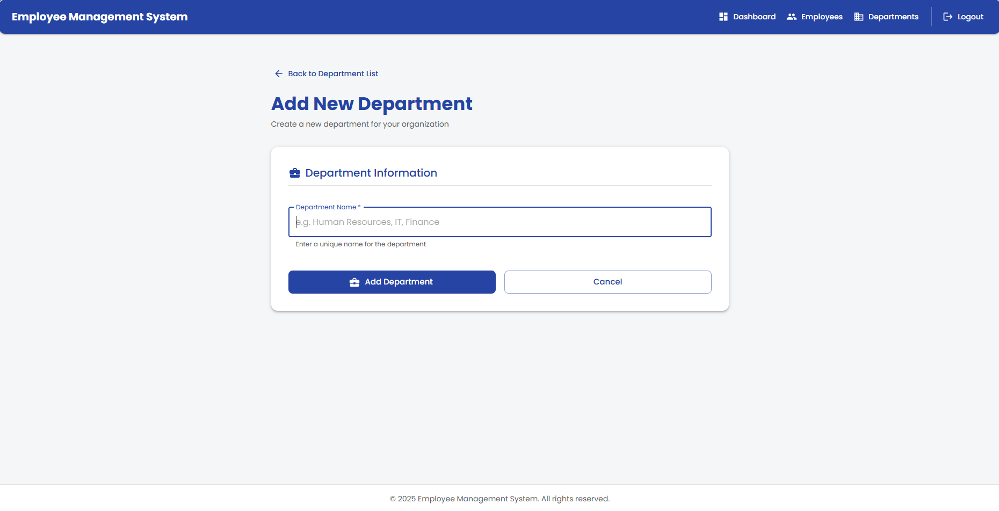
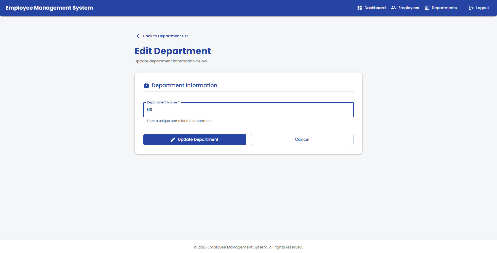
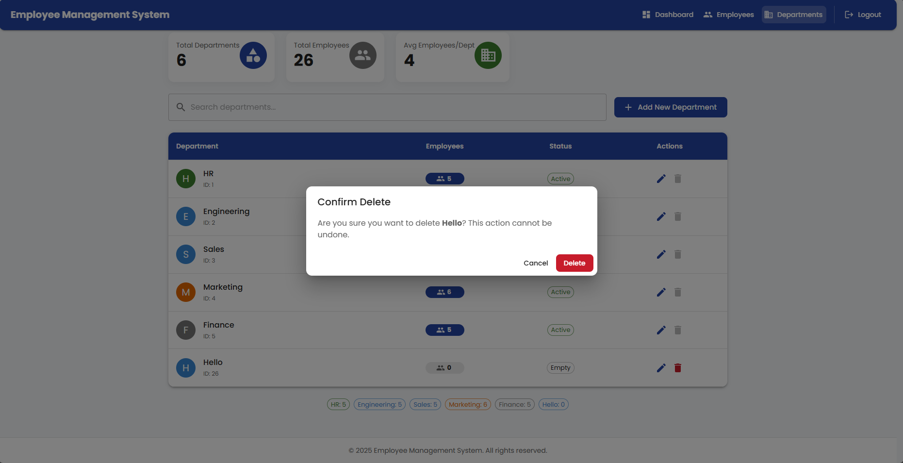

# Employee Management System

This is a full-stack web application built with a Laravel backend and a React frontend. The application allows for the management of employee and department data within an organization.

---

## Features

- **User Authentication:** Secure login and logout functionality using Laravel Sanctum.
- **Interactive Dashboard:** Displays key statistics such as total employees, average salary, and employee count by department.
- **Department Management (CRUD):** Add, view, update, and delete department data.
- **Employee Management (CRUD):** Add, view, update, and delete employee data.
- **Search & Pagination:** Real-time search and pagination for both department and employee lists.
- **Modern & Responsive UI:** Built with Material-UI (MUI) featuring a customizable corporate theme.

---

## Tech Stack

**Backend:**

- PHP / Laravel
- Laravel Sanctum (For API authentication)
- MySQL

**Frontend:**

- JavaScript / React
- Vite (As a build tool)
- Material-UI (MUI) (For UI components)
- Axios (For API calls)
- React Router (For navigation)

---

## Installation & Setup

Please ensure you have the following software installed:

- XAMPP (or any local server environment with PHP & MySQL)
- Composer
- Node.js & NPM

### Backend (Laravel)

1.  **Navigate to the backend folder:**
    ```bash
    cd employee-ms-backend
    ```
2.  **Install dependencies:**
    ```bash
    composer install
    ```
3.  **Set up the environment file:**
    - Copy `.env.example` to `.env`.
    - Run `php artisan key:generate`.
4.  **Database Configuration:**
    - Open the `.env` file and ensure the `DB_*` settings are correct.
    - Create a new database in phpMyAdmin named `employee_ms`.
5.  **Run Migrations & Seeders:**
    ```bash
    php artisan migrate --seed
    ```

### Frontend (React)

1.  **Open a new terminal** and navigate to the frontend folder:
    ```bash
    cd employee-ms-frontend
    ```
2.  **Install dependencies:**
    ```bash
    npm install
    ```

---

## Running the Application

You will need to run **two servers concurrently** in **two separate terminals**.

**1. Start the Backend Server:**

- In the terminal for the `employee-ms-backend` folder, run:
  ```bash
  php artisan serve
  ```
- The backend server will be running at `http://127.0.0.1:8000`.

**2. Start the Frontend Server:**

- In the terminal for the `employee-ms-frontend` folder, run:
  ```bash
  npm run dev
  ```
- The frontend application can be accessed at `http://localhost:5173` (or another specified port).

**Demo Login Credentials:**

- **Email:** `admin@example.com`
- **Password:** `password`

---

## Screenshots

1. Login
   

2. Dashboard
   

3. Employee Management
   

4. Department Management
   

5. Add Employee
   

6. Edit Employee
   

7. Delete Employee
   

8. Add Department
   

9. Edit Department
   

10. Delete Department
    
